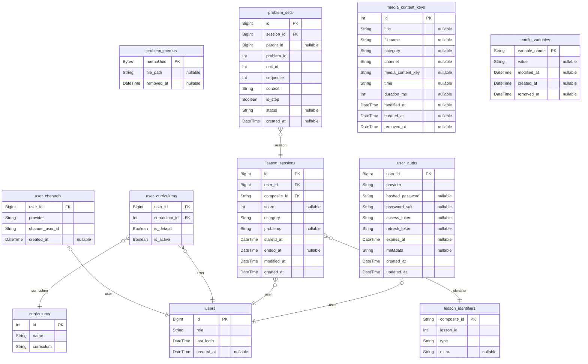

# Atlas
> Generated by [`prisma-markdown`](https://github.com/samchon/prisma-markdown)

- [default](#default)

## default

### `problem_memos`
#### 메모의 케이스

- 메모 작성하였지만 문제를 포기했을때

- 메모 작성하고 정답체크를 할때

- 정답체크를 실행하지 않은 상태에서 메모를 수정할때

- 정답체크를 실행하지 않은 상태에서 메모를 삭제할떄

**서버는 파일명을 생성하고 presigned url 로 직접 클라이언트가 올리도록 하는 방식**

#### 메모작성 시

- 메모는 클라이언트가 메모저장 할때 업로드 된다

- 문제에 대한 메모를 작성해야 할때 클라이언트는 서버에 요청한다

- 서버는 aws presigned url 을 생성하여 클라이언트에 내려주고

- 클라이언트는 메모파일을 업로드한다

메모수정 시

- 사용자가 문제를 푸는 상태일때, 클라이언트는 메모를 

**Properties**
  - `memoUuid`
    > Primary Key
    > 
    > 메모를 저장하기 위해 uuid 를 미리 생성
  - `file_path`
    > s3에 저장될 경로
    > 
    > 도메인은 저장하지 않아야 함
    > 
    > memo/uuid.png
  - `removed_at`
    > soft delete 를 지원하기 위한 컬럼
    > 
    > 주기적으로 테이블에서 removed_at 으로 검색하여 삭제

### `curriculums`

**Properties**
  - `id`: 
  - `name`: 커리큘럼 이름
  - `curriculum`: 커리큘럼 e.g) 1SEMESTER, 2SEMESTER, 3SEMESTER

### `user_channels`
다른 채널(성장판, 페이스북, 구글, 내부계정 등) 에서 가입된 유저를 모두 하나로 연결할 수 있도록 구성

성장판의 경우 초등학교, 중학교, 고등학교 로 ID가 나뉨

체험계정이 생성되고, 정회원 계정이 따로 생성됨

provider, channelUserId 가 복합키로 설정되어 있음

**Properties**
  - `user_id`: 
  - `provider`: 성장판, google, 다른 가입 채널들
  - `channel_user_id`: 성장판에서 사용하고 있는 유저ID or google 에서 사용하고 있는 userId
  - `created_at`: 생성일

### `user_curriculums`
유저가 가입한 커리큘럼 정보

**Properties**
  - `user_id`: 유저의 ID
  - `curriculum_id`: 커리큘럼의 ID
  - `is_default`
    > 기본 커리큘럼 여부
    > 
    > 기본 커리큘럼은 유저가 가입한 커리큘럼 중 하나를 기본으로 선택하여 사용
    > 
    > 자신의 본 커리큘럼이라고 보는게 맞을듯함
    > 
    > 예를 들어 중2-1 에서 학습중이고, 중1-1 로 진도를 수정했을때 자신의 본 커리큘럼을 잊지 않도록 함
  - `is_active`
    > 활성화 여부
    > 각 커리큘럼이 활성화 상태를 저장
    > 
    > 만약 중1-1 커리큘럼을 수강하다가 초등학생 커리큘럼을 수강한다면 true
    > 
    > 초등학생 커리큘럼을 두달후에 중단한다면 false 로 변경

### `lesson_sessions`
유저기반 학습내역을 저장

스코어에서는 비디오를 본 학습내역은 해당 테이블에 기록되자 않고 다른 테이블에 기록됨

그래서 서버에서 두가지 테이블을 조회하여 학습내역을 합쳐서 보여줌

이 부분을 개선하기 위해 아틀라스에서는 한테이블에 학습내역으로 보이는것들을 모두 기록할 생각

학습을 구분하면 몇가지로 나뉨

- 비디오만 볼 수 있는 학습

- 문제를 풀 수 있는 학습

두가지를 분리하기 위해 카테고리 컬럼을 추가

**Properties**
  - `id`: Primary Key
  - `user_id`: 유저의 ID
  - `composite_id`: 로시안에서 관리하고 있는 compositeId
  - `score`: 레슨에서 받은 점수
  - `category`
    > 학습 카테고리
    > 
    > - 학습할 수 있는 타입: ProblemSets 존재
    > 
    > - 비디오만 볼 수 있는 타입: ProblemSets 없음
  - `problems`: 문제 데이터 (JSON 형태로 저장)
  - `staretd_at`: 레슨 시작시간
  - `ended_at`: 레슨 종료시간
  - `modified_at`: 수정일
  - `created_at`: 생성일

### `user_auths`
유저의 인증 정보를 저장하는 테이블

내부 계정과 외부 인증(OAuth) 정보를 모두 관리

**Properties**
  - `user_id`: Primary Key
  - `provider`: 인증 제공자 (local, google, facebook 등)
  - `hashed_password`: 내부 계정용 비밀번호 (provider가 local일 경우)
  - `password_salt`: 
  - `access_token`: OAuth 관련 정보 (외부 인증의 경우)
  - `refresh_token`: 
  - `expires_at`: 
  - `metadata`: OAuth 제공자별 추가 정보 (JSON 형태로 저장)
  - `created_at`: 생성일
  - `updated_at`: 수정일

### `users`

**Properties**
  - `id`: Primary Key
  - `role`
    > 유저의 권한
    > 
    > [개념학습, 연산학습, 둘다], [중학생 커리큘럼만], [초등학교 커리큘럼, 중학교 커리큘럼]
  - `last_login`: 마지막 로그인 시간
  - `created_at`: 생성일

### `lesson_identifiers`
lessonId, type, extra 세가지를 묶는 복합키로 스코어수학에서는 compositeId 개념이 있음

compositeId는 로시안에서 관리되고 있으나, 실제로는 불필요한 부분이 있음(eg. KNRLESS51223)

extra 가 가지고 있는 데이터의 타입은 text 이지만, null, numberic, [array] 등을 지원해야하기 때문에

복합키의 개념을 테이블에서도 저장하여 사용

**Properties**
  - `composite_id`: lessonId, type, extra 세가지를 묶는 복합키
  - `lesson_id`: 로시안에서 관리되고 있는 lessonId
  - `type`: 로시안에서 관리되고 있는 학습유형 (LESSON, SECLESSON, REVIEW, SECREVIEW, TUTORIAL...)
  - `extra`: null, 1, SEMESTER, [51123], [51123, 51124], [51129, 1] 등으로 각각의 타입마다 의미하는 바가 다름

### `problem_sets`
레슨에 진입 시 LessonSession 이 생성되고 문제셋이 출제 됨

문제셋은 한번에 INSERT 되어 관리됨

row1 { sesionId: 1000, problemId: 100, unitId: 4, sequence: 0, context: lesson, isStep: false }

100번 문제를 풀고 스텝문제가 출제가 되었다면

row2 { sessionId: 1000, problemId: 444, unitId: 4, sequence: 0, context: lesson, isStep: true }

**Properties**
  - `id`: Primary Key
  - `session_id`: 학습내역 하나에 대한 외래키
  - `parent_id`: 부모 문제 ID (스텝문제인 경우 메인문제의 ID, 메인문제인 경우 null)
  - `problem_id`: 로시안 문제번호
  - `unit_id`: 로시안 유닛번호
  - `sequence`: 문제의 순서, 1번째 문제
  - `context`
    > 문제를 어디에서 풀었는지 확인하는 컬럼
    > 
    > - 틀린문제 다시풀기
    > 
    > - 오답노트 스코어에서는 `problem_logs, problem_logs_retry, tag_note_logs, tag_note_retry` 로 분리되어 있음
    > 
    > 이 부분들을 각각 조회해서 서버에서 조립해주어야 하는 부분이 있었음
  - `is_step`: 스텝문제인지 확인하는 플래그
  - `status`
    > 문제의 상태
    > 
    > 틀렸다 맞았다 이것만 가지고 있는게 아닌, **세모** 상태가 존재
    > 
    > 개선할 수 있다면 개선하고 싶은 상태
    > 
    > - W: WRONG(문제를 틀림)
    > 
    > - A: AWAY(문제를 포기)
    > 
    > - R: RIGHT(문제를 맞춤)
    > 
    > - S: STEP(스텝문제출제)
    > 
    > 문제를 풀때 스텝문제를 풀게 되면 상태를 메인문제에 대해서만 저장한다
    > 
    > 메인문제는 자신의 상태 + 스텝에서 문제푼 상태 를 모두 저장한다
    > 
    > 스텝문제에서는 자신의 상태만 기록한다(틀리고 맞음)
  - `created_at`: 생성일

### `media_content_keys`
미디어 컨텐츠 키 정보를 저장하는 테이블

**Properties**
  - `id`: Primary Key
  - `title`: 레슨ID
  - `filename`: 파일명
  - `category`: 카테고리
  - `channel`: 채널 정보(모두 동일)
  - `media_content_key`: 미디어 컨텐츠 키(secret)
  - `time`
    > 시간 정보
    > 
    > hh:mm:ss:SSS
  - `duration_ms`: 재생 시간 (밀리초)
  - `modified_at`: 수정일
  - `created_at`: 생성일
  - `removed_at`: 삭제일

### `config_variables`
시스템 설정 변수를 저장하는 테이블

**Properties**
  - `variable_name`
    > Primary Key
    > 
    > 변수명을 키로 사용
  - `value`: 변수값
  - `modified_at`: 수정일
  - `created_at`: 생성일
  - `removed_at`: 삭제일