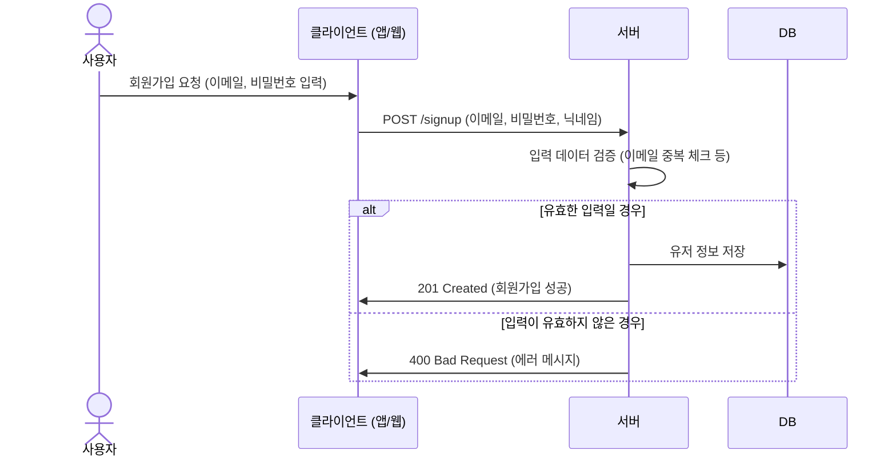

```mermaid
sequenceDiagram
  actor User as 사용자
  participant Client as 클라이언트 (앱/웹)
  participant Server as 서버
  participant DB as DB  

  User ->> Client: 회원가입 요청 (이메일, 비밀번호 입력)
  Client ->> Server: POST /signup (이메일, 비밀번호, 닉네임)
  Server ->> Server: 입력 데이터 검증 (이메일 중복 체크 등)
  alt 유효한 입력일 경우
    Server ->> DB: 유저 정보 저장
    Server ->> Client: 201 Created (회원가입 성공)
  else 입력이 유효하지 않은 경우
    Server ->> Client: 400 Bad Request (에러 메시지)
  end
```

