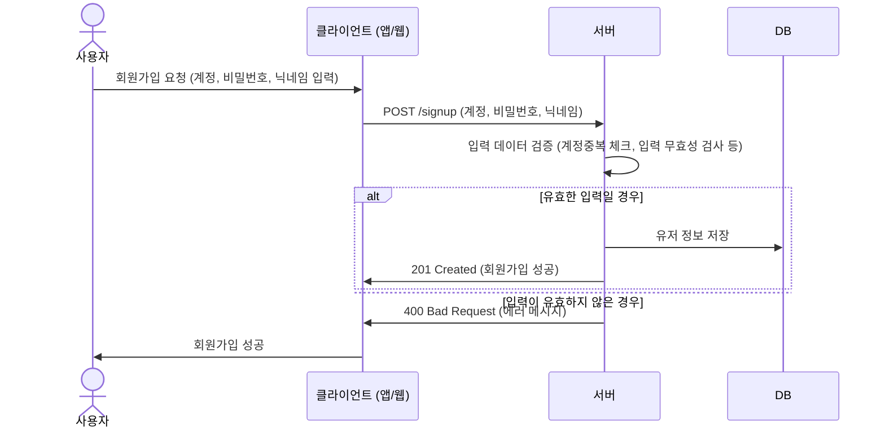

## 계정생성

```mermaid
sequenceDiagram
  actor User as 사용자
  participant Client as 클라이언트 (앱/웹)
  participant Server as 서버
  participant DB as DB  

  User ->> Client: 회원가입 요청 (계정, 비밀번호, 닉네임 입력)
  Client ->> Server: POST /signup (계정, 비밀번호, 닉네임)
  Server ->> Server: 입력 데이터 검증 (계정중복 체크, 입력 무효성 검사 등)
  alt 유효한 입력일 경우
    Server ->> DB: 유저 정보 저장
    Server ->> Client: 201 Created (회원가입 성공)
  else 입력이 유효하지 않은 경우
  end
  Server ->> Client: 400 Bad Request (에러 메시지)
  Client ->> User: 회원가입 성공
```

