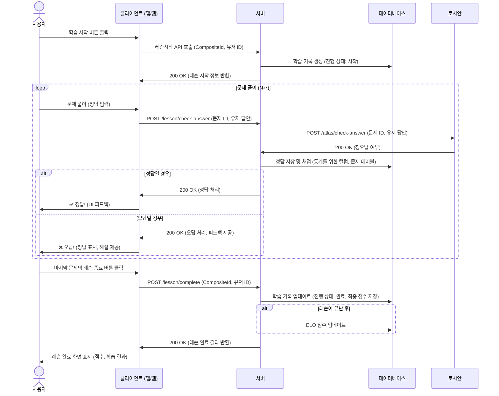

## 학습

```mermaid
sequenceDiagram
    actor User as 사용자
    participant Client as 클라이언트 (앱/웹)
    participant Server as 서버
    participant DB as 데이터베이스
    participant CMSServer as 로시안

    User->>Client: 학습 시작 버튼 클릭
    Client->>Server: 레슨시작 API 호출 (CompositeId, 유저 ID)
    Server->>DB: 학습 기록 생성 (진행 상태: 시작)
    Server->>Client: 200 OK (레슨 시작 정보 반환)

    loop 문제 풀이 (N개)
        User->>Client: 문제 풀이 (정답 입력)
        Client->>Server: POST /lesson/check-answer (문제 ID, 유저 답안)
        Server->>CMSServer: POST /atlas/check-answer (문제 ID, 유저 답안)
        CMSServer->>Server: 200 OK (정오답 여부)
        Server->>DB: 정답 저장 및 채점 (통계를 위한 컬럼, 문제 테이블)
        
        alt 정답일 경우
            Server->>Client: 200 OK (정답 처리)
            Client->>User: ✅ 정답! (UI 피드백)
        else 오답일 경우
            Server->>Client: 200 OK (오답 처리, 피드백 제공)
            Client->>User: ❌ 오답! (정답 표시, 해설 제공)
        end
    end

    User->>Client: 마지막 문제의 레슨 종료 버튼 클릭
    Client->>Server: POST /lesson/complete (CompositeId, 유저 ID)
    Server->>DB: 학습 기록 업데이트 (진행 상태: 완료, 최종 점수 저장)
    
    alt 레슨이 끝난 후
        Server->>DB: ELO 점수 업데이트
    end
    
    Server->>Client: 200 OK (레슨 완료 결과 반환)
    Client->>User: 레슨 완료 화면 표시 (점수, 학습 결과)
```

